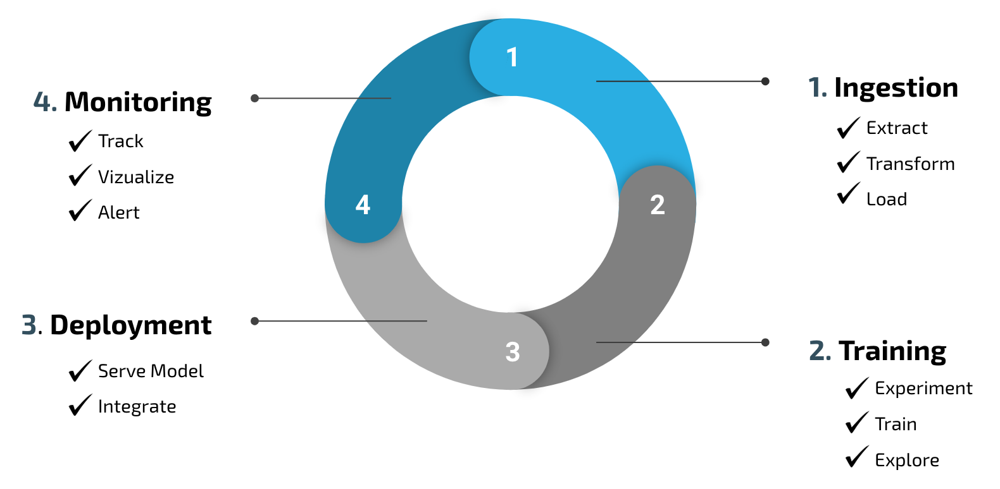
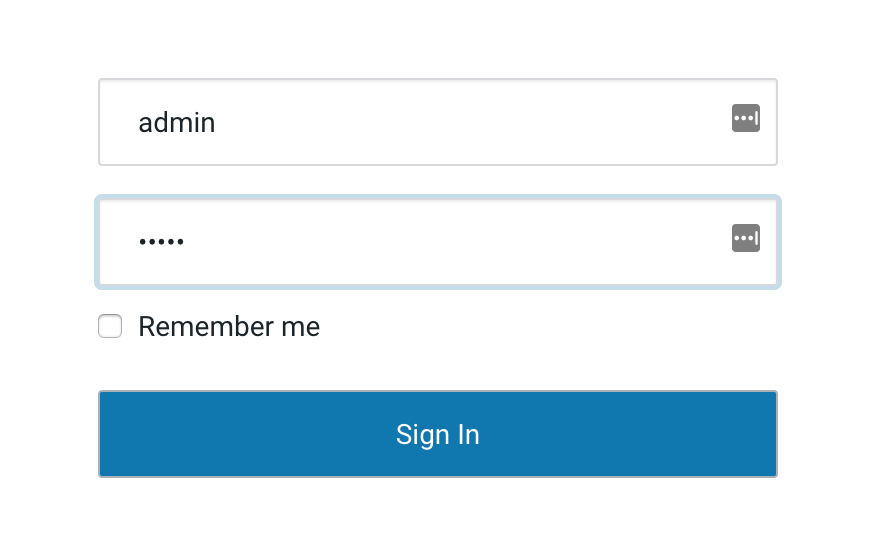
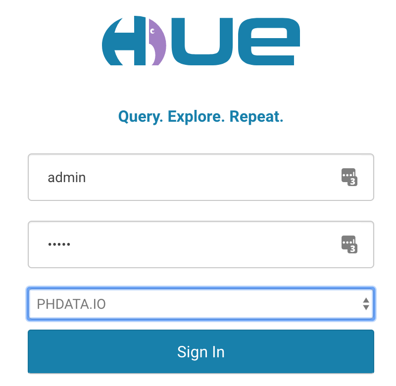
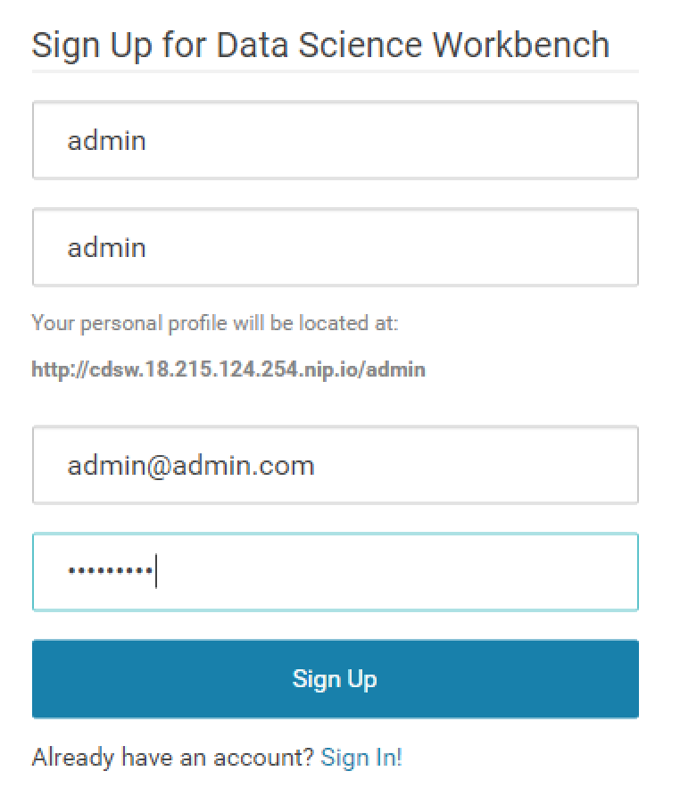
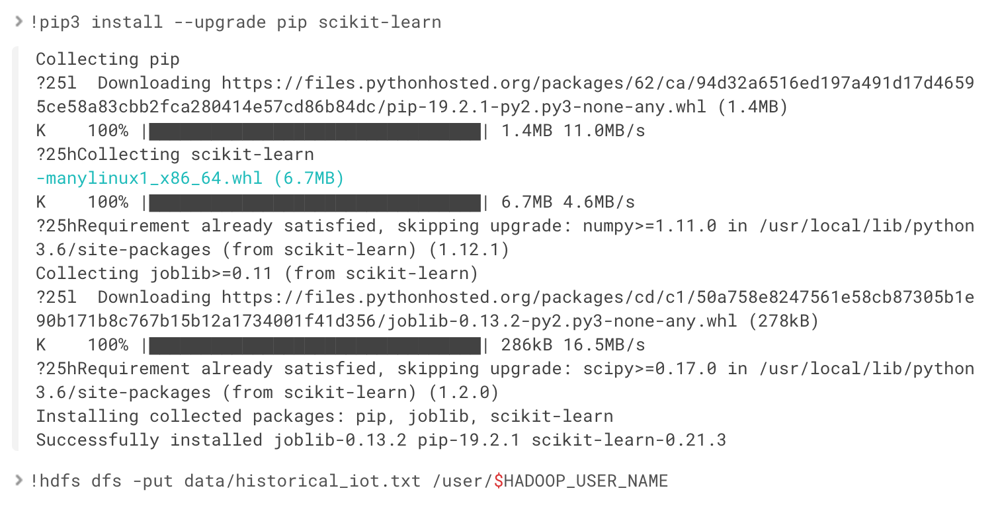
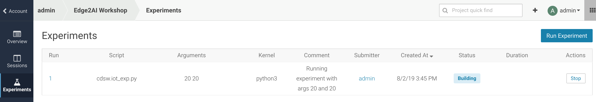
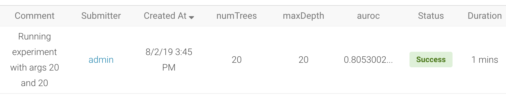
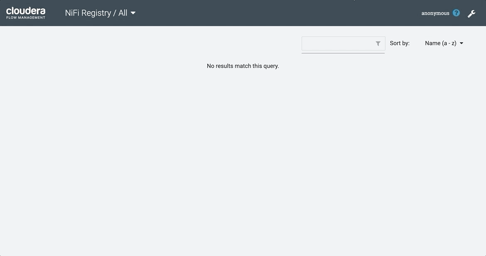
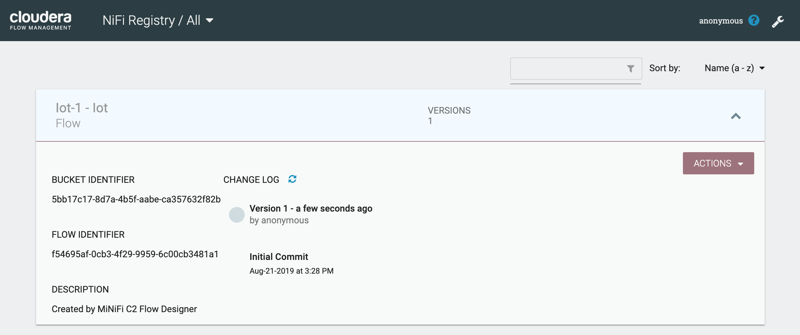
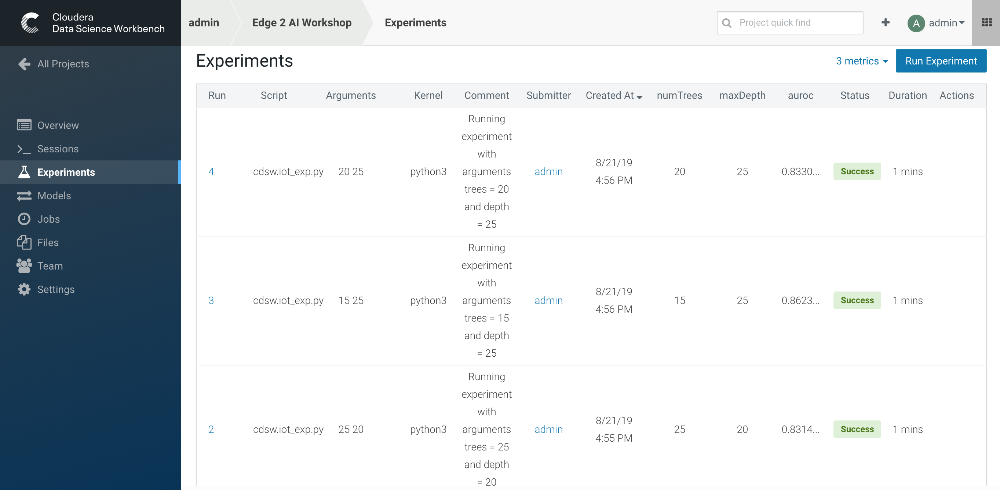

# Machine Learning on IOT Data for Predictive Maintenance

## Intro

In this workshop, you will build an end-to-end Machine Learning workflow following the principles set by a typical data ingestion pipeline.



The architecture we will use to accomplish this in this workshop is as follows.


### Workshop Requirements:

- Basic Hadoop knowledge
- Basic Machine Learning knowledge
- Knowledge on how to use SSH on Windows Putty or Mac’s Terminal.
  - On Windows have PuTTy installed or install OpenSSH for PowerShell, instruction here: https://docs.microsoft.com/en-us/windows-server/administration/openssh/openssh_install_firstuse
- Modern Operating; Windows 10 and latest MacOS version
- Modern web browser: Chrome or Firefox (not IE)

### Workshop Process:

1. On a simulated edge device we will run a simulator to send IOT sensor data that sends data to the MQTT broker.
2. On the simulated edge device we will also run  [**Apache MiNiFi**](https://nifi.apache.org/minifi/) to stream messages from the MQTT broker into [**Apache NiFi**](https://nifi.apache.org/).
3. Once inside **Apache NiFi** a workflow is running that prepares each message and publishes to [**Apache Kafka**](https://kafka.apache.org/).
4. On the Cloudera Data Platform we will utilize [**Apache Spark**](https://spark.apache.org/) to read data from Kafka, interact with the ML API endpoint, and store the data into [**Apache Kudu**](https://kudu.apache.org/).
5. We will use [**Cloudera Data Science Workbench**](https://www.cloudera.com/products/data-science-and-engineering/data-science-workbench.html) to develop, train, and experiment on a training data set.
6. Once the optimal model has been selected the next step is to use CDSW to deploy our Machine Learning model to offer an API endpoint.
7. The final stage of the workshop is to monitor the flow via CDSW monitoring and querying results with [**Apache Impala**](https://impala.apache.org/).


### Workshop Table of Contents:

- [Lab 1 - Initial Setup](#lab-1---initial-setup)
- [Lab 2 - CDSW: Train the model](#lab-2---cdsw-train-the-model)
- [Lab 3 - Configuring Edge Flow Management](#lab-3---configuring-edge-flow-management)
- [Lab 4 - NiFi Workflow and Publish to Kafka](#lab-4---nifi-workflow-and-publish-to-kafka)
- [Lab 5 - CDSW: Experiments and Model Selection](#lab-5---cdsw-experiments-and-model-selection)
- [Lab 6 - CDSW: Model Deployment](#lab-6---cdsw-model-deployment)
- [Lab 7 - Spark Processing](#lab-7---spark-processing)
- [Lab 8 - Kudu and Impala Analytics](#lab-8---kudu-and-impala-analytics)
- [Lab 9 - NiFi Stream Processing](#lab-9---nifi-stream-processing)
- [Lab 10 - Superset Dashboard](#lab-10---superset-dashboard)

## Lab 1 - Initial Setup

1. SSH into the cluster (IP and Port will be shared via email after Workshop registration).
2. Login into the necessary GUI interfaces in separate tabs.

  - **Cloudera Manager**:  7180 - User: admin Pass: admin
  - **Edge Flow Manager**: 10080/efm/ui - No Login
  - **NiFi**:              8080/nifi/ - No Login
  - **NiFi Registry**:     18080/nifi-registry - No Login
  - **Hue**:               8888 - User: admin Pass: admin
  - **CDSW**:              cdsw.<vm-public-IP\>.nip.io - Create User admin
  - **Apache Superset**:   8090 - User: admin Pass: admin

The **Cloudera Manager** login is the default credentials when CM is first started (admin/admin).



Logging into **Hue** for the first time makes the user provided the admin user. For the purpose of this workshop keep it easy and use the same credentials as Cloudera Manager (admin/admin). If you do use a different username, ensure that same user (case sensitive) is used when creating the CDSW user.



When logging into **CDSW** it is required to create a new user, please ensure the same username is used that was used with HUE.



## Lab 2 - CDSW: Train the model

In this and the following labs, you will wear the hat of a Data Scientist. You will develop the code to build the model, train it several times, and finally deploy the model to Production. All within 60 minutes!

**STEP 1** : Configure CDSW

Navigate to the CDSW **Admin** page to fine tune the environment:
- in the **Engines** tab, add in _Engines Profiles_ a new engine (docker image) with 2 vCPUs and 4 GB RAM, while deleting the default engine.
- add the following in _Environmental Variables_:
   ```
   HADOOP_CONF_DIR = /etc/hadoop/conf/
   ```


**Note**: this env variable is not required for a CDH 5 cluster.

**STEP 2** : Create the project

Return to the main page and click on **New Project**, using this GitHub project as the source:

```
https://github.com/phdata/edge2ai-workshop
```


After cloning and entering the project the first step of the process will be deleting the `images` folder from the repository. This is necessary to ensure Docker builds are small and only exists for reference purposes in the README/walkthrough.


Now that your project has been created, click on **Open Workbench** and start a Python3 Session with 2 vCPU/ 4 GiB Memory


**NOTE**: Chrome users shouldn't have issues here but IE users have had issues with the interactivity of CDSW because it will look like the workbench is always being created (red line) and never change to an "up" state (green line) without a manual refresh.

Once the Engine is ready, run the following command to install some required libraries and copy the historical dataset into HDFS:
```
!pip3 install --upgrade pip scikit-learn
!hdfs dfs -put data/historical_iot.txt /user/$HADOOP_USER_NAME
```



You're now ready to run Experiment to train the model on your historical data. At this point you can stop the Workbench Process.

**STEP 3** : Examine `cdsw.iot_exp.py`

Open the file `cdsw.iot_exp.py`. This is a python program that builds a model to predict machine failure (the likelihood that this machine is going to fail). There is a dataset available on hdfs with customer data, including a failure indicator field.

The program is going to build a failure prediction model using the Random Forest algorithm. Random forests are ensembles of decision trees. Random forests are one of the most successful machine learning models for classification and regression. They combine many decision trees in order to reduce the risk of overfitting. Like decision trees, random forests handle categorical features, extend to the multiclass classification setting, do not require feature scaling, and are able to capture non-linearities and feature interactions.

`spark.mllib` supports random forests for binary and multiclass classification and for regression, using both continuous and categorical features. `spark.mllib` implements random forests using the existing decision tree implementation. Please see the decision tree guide for more information on trees.

The Random Forest algorithm expects a couple of parameters:

numTrees: Number of trees in the forest.
Increasing the number of trees will decrease the variance in predictions, improving the model’s test-time accuracy. Training time increases roughly linearly in the number of trees.

maxDepth: Maximum depth of each tree in the forest.
Increasing the depth makes the model more expressive and powerful. However, deep trees take longer to train and are also more prone to overfitting. In general, it is acceptable to train deeper trees when using random forests than when using a single decision tree. One tree is more likely to overfit than a random forest (because of the variance reduction from averaging multiple trees in the forest).

In the `cdsw.iot_exp.py` program, these parameters can be passed to the program at runtime, to these python variables:

```
param_numTrees = int(sys.argv[1])
param_maxDepth = int(sys.argv[2])
```

Also note the quality indicator for the Random Forest model, are written back to the Data Science Workbench repository:

```
cdsw.track_metric("auroc", auroc)
cdsw.track_metric("ap", ap)
```

These indicators will show up later in the **Experiments** dashboard.

**STEP 4** : Run the experiment for the first time

Now, run the experiment using the following parameters:
```
numTrees = 20 numDepth = 20
```
From the menu, select `Run -> Run Experiments...`. Now, in the background, the Data Science Workbench environment will spin up a new docker container, where this program will run.

**NOTE**: The first run will take 20-30 minutes to build the container it will execute in. It will also not show up until you navigate to the **Experiments** page of CDSW. Please move forward to [Lab 3](#lab-3---configuring-edge-flow-management) as this process builds.


If the Status indicates ‘Running’, you have to wait till the run is completed. In case the status is ‘Build Failed’ or ‘Failed’, check the log information. This is accessible by clicking on the run number of your experiments. There you can find the session log, as well as the build information.



In case your status indicates ‘Success’, you should be able to see the auroc (Area Under the Curve) model quality indicator. It might be that this value is hidden by the CDSW user interface. In that case, click on the ‘3 metrics’ links, and select the auroc field. It might be needed to de-select some other fields, since the interface can only show 3 metrics at the same time.



In this example, ~0.8053. Not bad, but maybe there are better hyper parameter values available.

## Lab 3 - Configuring Edge Flow Management

[Cloudera Edge Flow Management](https://www.cloudera.com/products/cdf/cem.html) gives you a visual representation of all MiNiFi agents across your enterprise. This allows you to monitor status, update the pipeline configuration for each type of one workflow, and integrates with version control thanks to [**NiFi Registry**](https://nifi.apache.org/registry.html). In this lab, you will create a MiNiFi flow and publish it to the MiNiFi agent to transmit the MQTT messages.

**Step 1**: Configure NiFi Registry

Before we can start tracking workflows in MiNiFi (via EFM) or NiFi we need to configure NiFi Registry to communicate successfully with these tools. To accomplish this we need to do the following:

- Connect to NiFi Registry: http://public-hostname:18080/nifi-registry
- Create a New Bucket:
  - Wrench in top right -> Click "New Bucket"
  - Create a new bucket named "iot" **<- Case Sensitive!**



**Step 2**: EFM Configuration

Open the EFM Web UI at http://<public-hostname>:10080/efm/ui. Ensure you see your MiNiFi agent's heartbeat messages in the **Events Monitor**.


You can then select the **Flow Designer** tab and build the flow. To build a dataflow, select the desired class from the table and click OPEN. Alternatively, you can double-click on the desired class.

Add a _ConsumeMQTT_ Processor to the canvas and configure it with below settings:
```
Broker URI: tcp://localhost:1883
Client ID: minifi-iot
Topic Filter: iot/#
Max Queue Size = 60
```


**Step 3**: Connect MiNiFi and NiFi Communication

At this point you need to connect the ConsumerMQTT processor to the RPG, however, you first need the ID of the NiFi entry port. Open NiFi Web UI at http://<public-hostname>:8080/nifi/ and add an _Input Port_ to the canvas. Call it something like "From MiNiFi" and copy the ID of the input port, as you will soon need it.


To close the NiFI flow - as it is required -, you can temporarily add a _LogAttribute_ processor, and setup 2 connections:
- from the Input Port to LogAttribute;
- from LogAttribute to itself.

Start the InputPort, but keep the LogAttribute in a stopped state.


Back to the Flow Designer, add a _Remote Process Group_ to the canvas and configure it as follows:

```
URL = http://<hostname>:8080/nifi
```

Once complete, connect the ConsumeMQTT to the RPG via the connection ID copied from the NiFi gateway.


**Step 4**: EFM Publish to MiNiFi

The MiNiFi flow is now complete and we can publish our workflow to our MiNiFi agent. Once we publish our workflow and add a comment the following steps occur:
- Version the workflow in NiFi Registry
- Ship the YAML configuration file to the MiNiFi Agent and restart it with the live workflow


If successful, you will see the Flow details in the NiFi Registry.



**Step 5**: Test MiNiFi Agent

At this point, you can test the edge flow up until NiFi. Start the simulator again and confirm you can see the messages queued in NiFi.

```
sudo su -
python ~/mqtt.iot_simulator.py ~/mqtt.iot.config
```


## Lab 4 - NiFi Workflow and Publish to Kafka

In this lab, you will create a NiFi flow to receive the data from the MiNiFi gateway and push it to **Kafka**. The Kafka service and topic name have already been configured and it is now time to Publish our events coming off of the MiNiFi device.

**Step 1**: Publish to Kafka

Open the NiFi web UI and add a _PublishKafka_2.0_ processor and configure it as follows:

```
Kafka Brokers: <hostname>:9092
Topic Name: iot
Use Transactions: False
```

Connect the Input Port to the PublishKafka processor by dragging the destination of the current connection from the LogAttribute to the PublishKafka. As with the LogAttribute, create a connection from the PublishKafka to itself. Then you can start the Kafka processor.


You can add more processors as needed to process, split, duplicate or re-route your FlowFiles to all other destinations and processors but for the purpose of this workshop we are complete with the NiFi workflow.

## Lab 5 - CDSW: Experiments and Model Selection

**STEP 1** : Re-run the Experiment with Different Parameters

Go back to the Workbench and run the experiment 2 more times and try different values for NumTrees and NumDepth. Try the following values:

```
NumTrees NumDepth
15       25
25       20
20       25
```


When all runs have completed successfully, check which parameters had the best quality (best predictive value). This is represented by the highest ‘area under the curve’, auroc metric.



**STEP 2** : Save the best model to your environment

Select the run number with the best predictive value, in this case, experiment 2. In the Overview screen of the experiment, you can see that the model in spark format, is captured in the file `iot_model.pkl`. Select this file and hit the **Add to Project** button. This will copy the model to your project directory.


## Lab 6 - CDSW: Model Deployment

In this section we will deploy the model we selected in the previous lab by utilizing the **Models** section of CDSW.

**STEP 1** : Examine the program `cdsw.iot_model.py`

Open the project you created in the previous lab, and examine the file in the Workbench. This PySpark program uses the pickle.load mechanism to deploy models. The model it refers to the `iot_modelf.pkl` file, was saved in the previous lab from the experiment with the best predictive model.

There is a predict definition which is the function that calls the model, using features, and will return a result variable.

Before deploying the model, try it out in the Workbench: launch a Python3 engine and run the code in file `cdsw.iot_model.py`. Then call the `predict()` method from the prompt:

```
predict({"feature": "0, 65, 0, 137, 21.95, 83, 19.42, 111, 9.4, 6, 3.43, 4"})
```


The functions returns successfully, so we know we can now deploy the model. You can now stop the engine.

**STEP 2** : Deploy the model

From the projects page of your project, select the **Models** button. Select **New Model** and populate specify the following configuration:

```
Name:          IoT Prediction Model
Description:   IoT Prediction Model
File:          cdsw.iot_model.py
Function:      predict
Example Input: {"feature": "0, 65, 0, 137, 21.95, 83, 19.42, 111, 9.4, 6, 3.43, 4"}
Kernel:        Python 3
Engine:        2 vCPU / 4 GB Memory
Replicas:      1
```


If all parameters are set, you can hit the **Deploy Model** button. Wait till the model is deployed. This will take several minutes.

**STEP 3** : Test the deployed model

The model should get to the **Deployed** state. Now, click on the Model Name link, to go to the Model Overview page. From the that page, hit the **Test** button to check if the model is working.

The green color with success is telling that our REST call to the model is technically working. And if you examine the response: `{“result”: 1}`, it returns a 1, which mean that machine with these features is functioning properly.

Once we have tested the model accepts requests, lets change the input parameters and call the predict function again. Put the following values in the Input field:

```
{
  "feature": "0, 95, 0, 88, 26.62, 75, 21.05, 115, 8.65, 5, 3.32, 3"
}
```

With these input parameters, the model returns 0, which mean that the machine is likely to break. Take a note of the **AccessKey** as you will need this for lab 8.


## Lab 7 - Spark Processing

In this lab we will be using the Spark Streaming processing framework to process the messages streaming into Kafka. This means we will be consuming Kafka messages streaming in from the edge device, sending the contents of that data to the ML Model API, and saving the predictions to Kudu. These predictions tell us whether or not our model anticipates breakage and we will be able to leverage Kudu to analyze these results.

**Step 1**: Create Spark Job

Now you can configure and run the Spark Streaming job. You will need the CDSW Access Key you saved from the previous lab.

Open a second Terminal and SSH into the Gateway Node. The first is running the sensor data simulator, so you can't use it or else you will stop the data from flowing in.

In the second terminal run the following commands:

```
sudo su -
~/spark.iot.sh <CDSW model access key>
```

**Note**: you might have to use `spark2-submit` if you're running this demo out of a CDH 5 cluster.

Spark Streaming will flood your screen with log messages, however, at a 5 seconds interval, you should be able to spot a table: these are the messages that were consumed from Kafka and processed by Spark. Yu can configure Spark for a smaller time window, however, for this exercise 5 seconds is sufficient.


## Lab 8 - Kudu and Impala Analytics

In this lab, you will run some SQL queries using the Impala engine. You can run a report to inform you which machines are likely to break in the near future.

Login into Hue, and run the following statement in the Impala Query

```
select sensor_id, sensor_ts from sensors where is_healthy = 0
```

Run a few times a SQL statement to count all rows in the table to confirm the latest inserts are always picked up by Impala. This allows you to build real-time reports to act on when it is predicted a machine might break.


At this point we have shown how to build an end to end workflow from Edge to AI on top of the tools the Cloudera platform offers. From this point forward the conversation needs to focus on maintaining and refining models like this so that they do not become stale and can provide business value going forward.


## Lab 9 - NiFi Stream Processing

The previous labs have demonstrated how to use all of the tools and how to interact with them via Spark code. This is great for teams with development backgrounds but for teams that would rather accomplish this via configuration it is also possible to accomplish this via NiFi processing. This section will call a custom built pipeline to call everything used previously using only configurations.

**Step 1** - Create a NiFi Process Group and Load Template

We want to separate our processing from the rest of our NiFi flow. This ensures specific processes are grouped together for easier management. Once the processing group is created we will add a template into the processing group to ensure our NiFi workload is loaded.


**Step 2** - Enable Controller Services

After the template has been loaded we need to enable the Controller Services to ensure they are active. These were loaded as part of the template and are not enabled by default.


**Step 3** - Update the CDSW API Code in UpdateAttribute processor

CDSW generates an API key for each model that is deployed in order to ensure message traffic is routed correctly and security can be followed. This API key needs to be updated to match the model deployed for it to correctly score the data being generated from the edge device.


**Step 4** - Update the CDSW HTTP endpoint in InvokeHTTP processor

Similar to the API key, the CDSW model HTTP endpoint has a different hostname for each deployment. We need to pick the correct endpoint and update it in our NiFi configurations.


**Step 5** - Start NiFi processes

We are now at the point where we can turn on the NiFi processes, this needs to be done for everything in the yellow and blue boxes (the gray box isn't required).


## Lab 10 - Superset Dashboard

Navigate to the Superset server to pull up the dashboard for watching the Spark Streaming processor and the NiFi processor.

```
http://<public_hostname>:8089/dashboard/list/
```


## Appendix
<details>
  <summary>Resources</summary>

  [Original blog by Abdelkrim Hadjidj](https://medium.freecodecamp.org/building-an-iiot-system-using-apache-nifi-mqtt-and-raspberry-pi-ce1d6ed565bc)

  [Cloudera Documentation](https://www.cloudera.com/documentation.html)
</details>

## Troubleshooting
<details>
    <summary>CEM doesn't pick up new NARs</summary>

  Delete the agent manifest manually using the EFM API:

  Verify each class has the same agent manifest ID:

  ```
  http://hostname:10080/efm/api/agent-classes
  [{"name":"iot1","agentManifests":["agent-manifest-id"]},{"name":"iot4","agentManifests":["agent-manifest-id"]}]
  ```

  Confirm the manifest doesn't have the NAR you installed

  ```
  http://hostname:10080/efm/api/agent-manifests?class=iot4
  [{"identifier":"agent-manifest-id","agentType":"minifi-java","version":"1","buildInfo":{"timestamp":1556628651811,"compiler":"JDK 8"},"bundles":[{"group":"default","artifact":"system","version":"unversioned","componentManifest":{"controllerServices":[],"processors":
  ```

  Call the API

  ```
  http://hostname:10080/efm/swagger/
  ```
  Hit the `DELETE - Delete the agent manifest specified by id` button, and in the id field, enter `agent-manifest-id`
</details>
